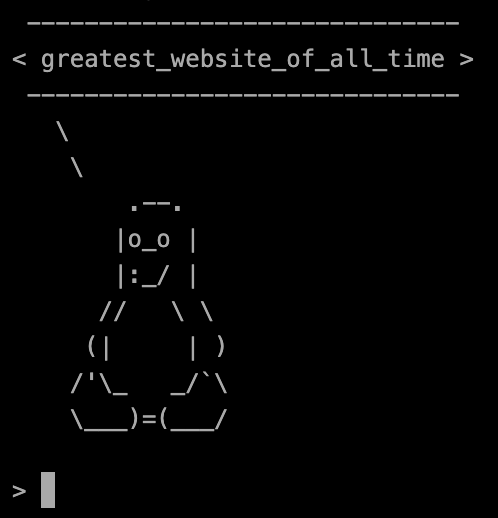
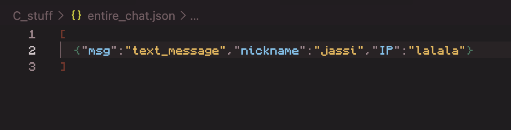
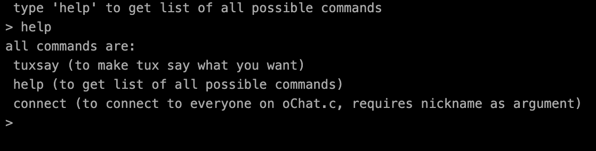

> NOTE: LLM Usage was there, it was used for fixing mainly HTTP errors, Majority Of The Code Was Written By ***HUMANS***  

# openChat.c   

> OpenChat.c, It Is An OpenSource Texting Platform Which Has A Terminal Style Ui Made Using [Jquery-Terminal](https://terminal.jcubic.pl/) And Has A ***CUSTOM MADE*** HTTP Server Powering It Using A Custom Json Based DataBase You Can Check It Out By   
> [(Clicking ME!)](https://ochatc.jassi.dev/)

### Why should i use this?

 because:

1. It's free :)
2. Its cool
3. Its Made From Scratch
4. Why not?

### How to use On Local Machine

   > You Can Download The Repository And Run `build.sh` && `python3 -m http.server 6967` So That You Can Have A Working Version Of The Website At http://localhost:6967/ (funni number :P )     also  Tux Has Somethings To Say:  
   > 

## Some Stuff

| The Database Needs To Have Atleast 1 Value To Work|  |
| ------------- | ------------- |
| All The Commands Are: |  |

> Credits to Nox For The Amazing Logo  
> thats it, jassi out :)
